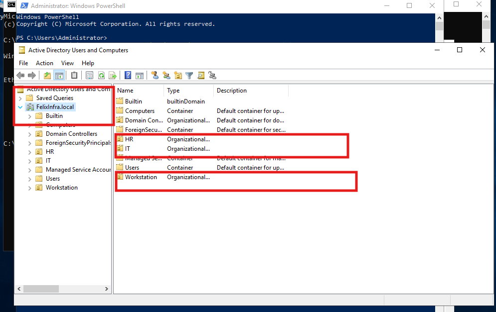
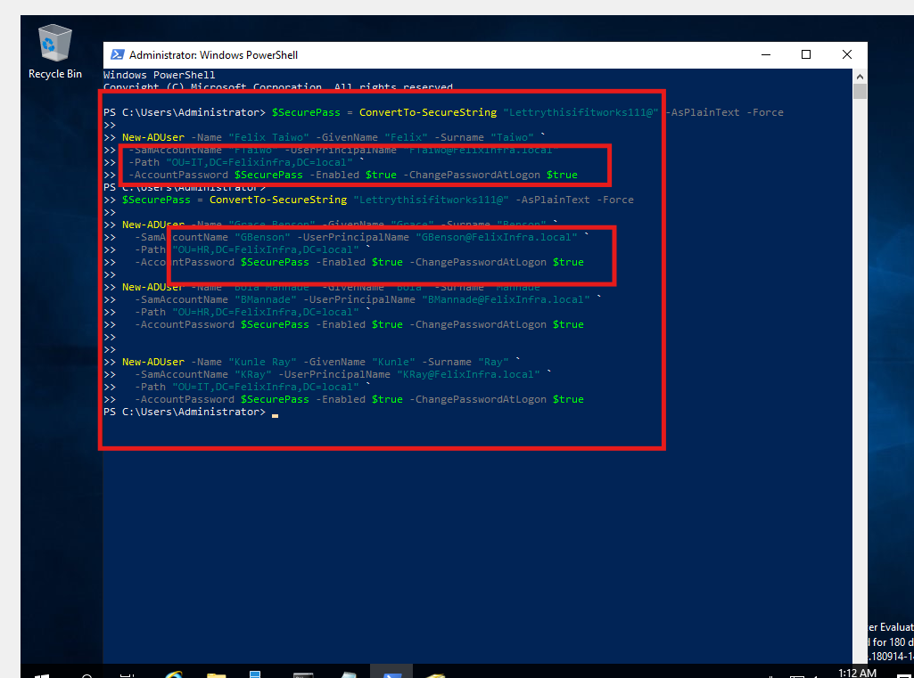
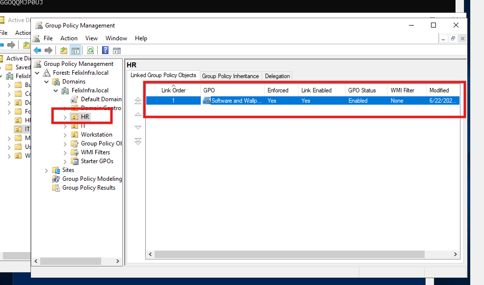
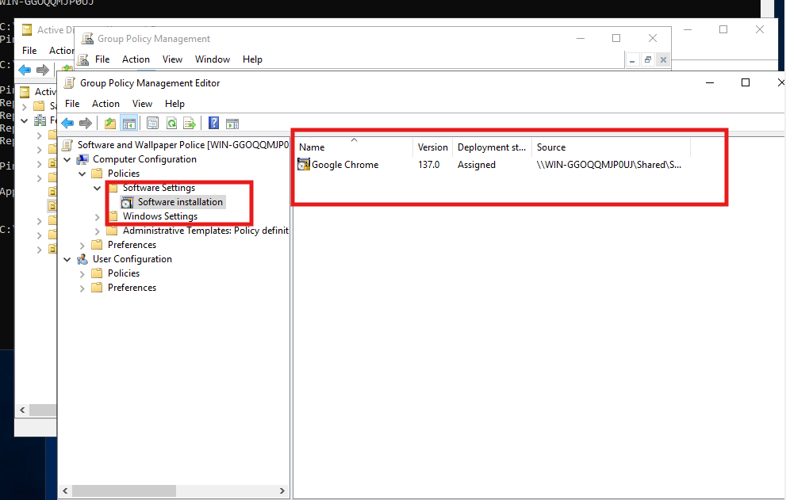
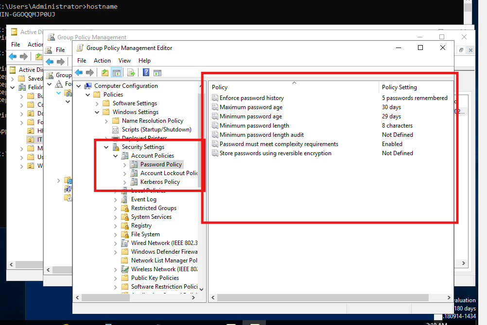

# Windows Server Lab: Active Directory, PowerShell Automation & Group Policy

This hands-on lab simulates a fully functional Windows Server environment built from scratch. It covers the complete deployment of Active Directory, structured Organizational Units (OUs), automated user onboarding with PowerShell, and Group Policy Object (GPO) configurations for software installation, security enforcement, and desktop customization.

Designed to demonstrate real-world IT infrastructure setup and endpoint management skills.

---

## 🔧 Lab Objectives

- Configure a Windows Server Domain Controller with `Active Directory Domain Services (AD DS)`
- Create Organizational Units (HR, IT, etc.) to logically group users
- Automate user creation using PowerShell
- Apply Group Policy Objects (GPOs) to:
  - Enforce password policies
  - Install software (e.g., Google Chrome) at logon
  - Deploy desktop wallpaper across departments

---

## 🧪 Key Features

- **OU Structure** with HR and IT groups
- **PowerShell Scripting** for batch user onboarding
- **GPO Deployment**:
  - Password policy (min length, complexity, aging)
  - Software installation via MSI
  - Wallpaper configuration via network share

---

## 🖼️ Screenshots

### OU and User Creation

### GPO Linked to HR OU

### Software Deployment via GPO

## 🛡️ Security Policies Enforced via GPO

The following security policies were configured through Group Policy to harden user workstations and enforce organizational standards:

### 🔐 Password Policy Settings

| Policy Setting                          | Value                  |
|----------------------------------------|------------------------|
| Enforce password history               | 5 passwords remembered |
| Maximum password age                   | 30 days                |
| Minimum password age                   | 29 days                |
| Minimum password length                | 8 characters           |
| Password must meet complexity rules    | Enabled                |
| Store passwords using reversible encryption | Not defined       |

📸 _Password Policy Screenshot:_  

---

### 🚫 User Interface Restrictions

| Policy                                   | Status     |
|------------------------------------------|------------|
| Disable Control Panel and Settings App   | Enabled    |
| Prevent access to Command Prompt         | Enabled    |

These settings ensure users cannot tamper with system configurations or execute unauthorized scripts or commands.

---

### 📋 Audit Policy (Security Logging)

| Policy               | Status  |
|----------------------|---------|
| Audit logon events   | Enabled |

This logs every successful and failed login attempt for security monitoring and compliance auditing.

---

## 📁 Project Structure

📁 images/
├── ou-creation-powershell.png  
├── user-creation-powershell.png  
├── GPO-linked-to-HR.png  
├── GPO-Configuration.png  
├── Security-Setting-Enforce.png  
README.md

---

## 🚀 How to Use This Lab

This lab can be recreated using a Hyper-V or VirtualBox environment with:
- 1 Domain Controller VM (Windows Server 2019 or later)
- 1 or more Windows 10/11 client VMs
- Network set to internal or bridged for domain communication

---

## 📌 Author

**Adekunle Felix Taiwo**  
🔗 [LinkedIn](https://www.linkedin.com/in/felixtaiwo)  
📂 [Other Projects](https://github.com/TAdekunleF)

